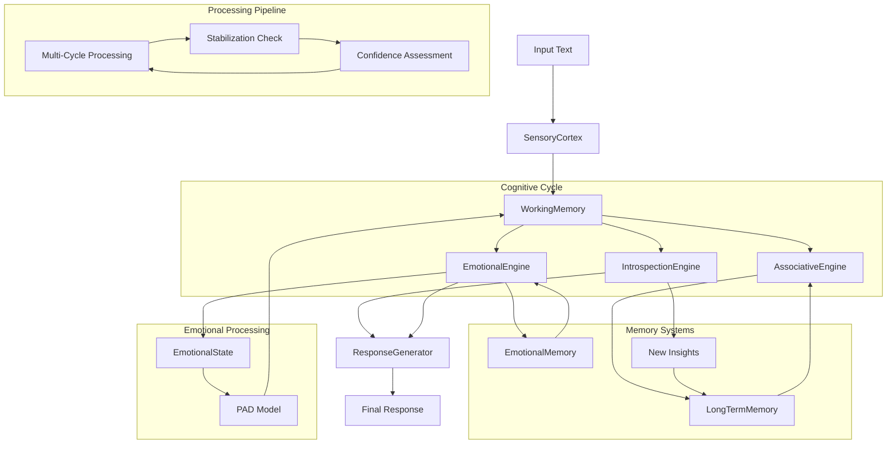

# Architecture: Metacognitive Engine

> "The perfect man uses his mind like a mirror - grasping nothing, refusing nothing, receiving but not storing." - Zhuangzi

## 1. Guiding Philosophy

This project implements a sophisticated AI consciousness simulation based on **Global Workspace Theory** and metacognitive principles. Rather than a simple request-response system, we simulate a **flow of consciousness** where external inputs trigger internal associative and reflective processes through multiple cognitive cycles before generating a coherent response.

The architecture moves beyond basic archival to create a dynamic model of thinking processes, where specialized cognitive processors interact through a shared workspace to achieve emergent intelligence.

## 2. System Architecture Overview



## 3. Core Components

### 3.1. SensoryCortex (Perceptual Analysis)

**Responsibility:** Transform raw text input into rich, structured cognitive data.

**Technology Stack:**
- Google Gemini AI for advanced language understanding
- spaCy for entity extraction and linguistic analysis
- Fallback pattern matching for offline operation

**Process:**
1. **Intent Recognition:** Classifies user goals (QUESTION, REFLECTION, STATEMENT, COMMAND)
2. **Sentiment Analysis:** Determines emotional tone (POSITIVE, NEGATIVE, CURIOUS, SKEPTICAL)
3. **Tone Detection:** Identifies communication style (FORMAL, CASUAL, EMOTIONAL)
4. **Entity Extraction:** Identifies key concepts and named entities
5. **Language Detection:** Supports multilingual processing (English/Russian)

**Output:** `StructuredInput` object containing:
```python
@dataclass
class StructuredInput:
    raw_text: str
    language: str
    entities: List[tuple]
    intent: str
    sentiment: str
    tone: str
    confidence: float
    metadata: Dict[str, Any]
```

### 3.2. WorkingMemory (Central Blackboard)

**Responsibility:** Act as the central coordination hub implementing Global Workspace Theory.

**Architecture Pattern:** Central blackboard where all cognitive processors read and write shared state.

**Contents:**
- Current `StructuredInput` from perception
- Retrieved memories from long-term storage
- Generated insights and associations
- Cognitive state tracking (cycles, confidence, stability)
- Context tags and metadata

**Key Features:**
- **State Management:** Tracks cognitive cycles and processing state
- **Memory Coordination:** Manages flow between short and long-term memory
- **Context Synthesis:** Provides unified view of current cognitive context
- **Stabilization Detection:** Determines when processing should conclude

### 3.3. LongTermMemory (Persistent Knowledge Store)

**Responsibility:** Persistent storage and semantic retrieval of consciousness entries.

**Technology Stack:**
- ChromaDB for vector database operations
- Sentence Transformers (paraphrase-multilingual-mpnet-base-v2) for embeddings
- HNSW indexing for fast similarity search
- Cosine similarity for semantic matching

**Key Features:**
- **Semantic Search:** Vector-based similarity matching beyond keyword search
- **Multilingual Support:** Unified embedding space for English/Russian
- **Optimized Thresholds:** Distance threshold of 8.0 for optimal precision/recall
- **Persistent Storage:** Maintains memory across system restarts

**Memory Types:**
```python
class EntryType(Enum):
    INSIGHT = "insight"
    PARADOX = "paradox"  
    QUESTION = "question"
    HYPOTHESIS = "hypothesis"
    FACT = "fact"
    USER_FEEDBACK = "user_feedback"
```

### 3.4. Cognitive Processors

#### 3.4.1. AssociativeEngine
**Responsibility:** Find semantically relevant memories for current context.

**Process:**
1. Extract query from current working memory context
2. Perform vector similarity search in long-term memory
3. Filter results by distance threshold (< 8.0)
4. Add relevant associations to working memory
5. Update cognitive state with association count

**Optimization:** Balances precision vs. recall for maximum cognitive relevance.

#### 3.4.2. IntrospectionEngine  
**Responsibility:** Generate insights and detect cognitive patterns.

**Technology:** Google Gemini AI for advanced reasoning and pattern detection.

**Capabilities:**
- **Insight Generation:** Creates new understanding from context synthesis
- **Paradox Detection:** Identifies logical contradictions and tensions
- **Question Formation:** Generates probing questions for deeper exploration
- **Confidence Assessment:** Evaluates certainty of cognitive conclusions
- **Meta-Reasoning:** Reflects on the reasoning process itself

**Output:** New `Entry` objects added to both working and long-term memory.

#### 3.4.3. EmotionalEngine
**Responsibility:** Process emotional content and maintain emotional state awareness.

**Technology:** 
- Google Gemini AI for emotion analysis and pattern recognition
- PAD (Pleasure-Arousal-Dominance) emotional model
- Fallback pattern-based emotion detection

**Core Features:**
- **Emotion Analysis:** AI-powered detection of 18 emotion types
- **Emotional State Tracking:** Maintains current emotional state using PAD model
- **Emotional Memory:** Persistent storage of emotional experiences with decay
- **Emotional Context:** Provides emotional guidance for response generation

**Emotional Model:**
```python
class EmotionalState:
    valence: float     # Pleasure: -1.0 (negative) to +1.0 (positive)
    arousal: float     # Arousal: 0.0 (calm) to 1.0 (excited)
    dominance: float   # Dominance: 0.0 (submissive) to 1.0 (dominant)
    emotions: Dict[EmotionType, float]  # 18 specific emotions
```

**Emotional Quadrants:**
- **Excited**: High valence + High arousal (joy, excitement)
- **Content**: High valence + Low arousal (contentment, peace)
- **Distressed**: Low valence + High arousal (anger, fear)
- **Depressed**: Low valence + Low arousal (sadness, guilt)

**Process Flow:**
1. Analyze input text for emotional content
2. Update current emotional state based on detected emotions
3. Retrieve relevant emotional memories
4. Create emotional context tags for response generation
5. Store significant emotional experiences in memory

#### 3.4.4. ResponseGenerator
**Responsibility:** Synthesize emotionally-aware, coherent responses from cognitive processing.

**Technology:** Google Gemini AI with emotion-enhanced context prompting.

**Process:**
1. Gather all working memory contents (input, memories, insights, emotions)
2. Integrate emotional context and guidance from EmotionalEngine
3. Construct rich context prompt with cognitive and emotional history
4. Generate contextually and emotionally appropriate response
5. Ensure response coherence, relevance, and emotional sensitivity

**Enhanced Features:**
- **Emotional Awareness:** Adapts tone and content based on emotional state
- **Context Integration:** Weaves together memories, insights, emotions, and current input
- **Tone Matching:** Responds appropriately to emotional cues in input
- **Empathy Simulation:** Demonstrates understanding of emotional context
- **Depth Control:** Provides appropriate level of detail and emotional support

## 4. Processing Flow

### 4.1. Multi-Cycle Cognitive Processing

The system implements a sophisticated multi-cycle processing model:

```python
def process_thought(self, text: str) -> str:
    """Advanced multi-cycle cognitive processing with emotional awareness"""
    # 1. Perception Phase
    structured_input = self.sensory_cortex.analyze(text)
    self.working_memory.set_input(structured_input)
    
    # 2. Multi-Cycle Processing
    for cycle in range(MAX_CYCLES):
        # Association Phase
        self.associative_engine.process(self.working_memory)
        
        # Introspection Phase  
        self.introspection_engine.process(self.working_memory)
        
        # Emotional Processing Phase (NEW)
        if self.emotional_engine:
            self.emotional_engine.process(self.working_memory)
        
        # Stabilization Check
        if self._is_stable():
            break
    
    # 3. Learning Phase
    self._save_insights_to_ltm()
    
    # 4. Response Generation (now emotionally-aware)
    return self.response_generator.generate_response(self.working_memory)
```

### 4.2. Stabilization Mechanism

**Criteria for Cognitive Stabilization:**
- Confidence score above threshold (0.7)
- Sufficient associations retrieved (> 0)
- Maximum cycles reached (3)
- No new insights generated in last cycle

### 4.3. Memory Consolidation

**Learning Process:**
1. New insights generated during processing are automatically saved
2. Successful cognitive patterns are reinforced
3. Failed processing attempts inform future improvements
4. Memory associations strengthen through repeated activation

## 5. Technical Implementation

### 5.1. Vector Search Optimization

**Distance Threshold Tuning:**
- Extensive testing revealed optimal threshold of 8.0
- Balances precision (relevant results) vs. recall (finding connections)
- Handles ChromaDB cosine distance range [0, ∞]

**Performance Characteristics:**
- Memory search: < 100ms for 10K+ entries
- Vector generation: < 50ms per entry
- Cognitive cycle: 2-5 seconds (with AI calls)

### 5.2. Error Handling & Resilience

**Graceful Degradation:**
- Fallback processing when AI services unavailable
- Robust error handling throughout cognitive pipeline
- Automatic recovery from vector search failures
- Comprehensive logging for debugging

### 5.3. API Integration

**MCP Server Implementation:**
- FastAPI-based REST endpoints
- Real-time cognitive processing via `/process`
- Legacy compatibility via `/reflect`
- Memory management via `/add`, `/query`, `/clear`

## 6. Design Patterns

### 6.1. Global Workspace Theory
- **Central Blackboard:** WorkingMemory coordinates all processing
- **Specialized Processors:** Each handles specific cognitive functions
- **Attention Mechanism:** Associative engine focuses on relevant content

### 6.2. Producer-Consumer Pattern
- Processors produce insights and consume context
- Asynchronous processing with shared state management
- Event-driven architecture for cognitive state changes

### 6.3. Repository Pattern
- LongTermMemory abstracts storage implementation
- Consistent interface for memory operations
- Pluggable storage backends (ChromaDB, future alternatives)

## 7. Emotional Architecture (NEW)

### 7.1. PAD Emotional Model

The system implements the **Pleasure-Arousal-Dominance (PAD)** model for comprehensive emotional processing:

```python
class EmotionalState:
    """Core emotional state using PAD model"""
    valence: float     # Pleasure dimension (-1.0 to +1.0)
    arousal: float     # Arousal dimension (0.0 to 1.0) 
    dominance: float   # Dominance dimension (0.0 to 1.0)
    emotions: Dict[EmotionType, float]  # 18 specific emotions
    timestamp: datetime
```

**Emotional Dimensions:**
- **Valence (Pleasure):** Negative emotions (-1.0) ↔ Positive emotions (+1.0)
- **Arousal:** Calm/Relaxed (0.0) ↔ Excited/Energetic (1.0)
- **Dominance:** Submissive/Controlled (0.0) ↔ Dominant/In-control (1.0)

### 7.2. Emotion Types

The system recognizes **18 distinct emotion types** organized by emotional families:

**Primary Emotions:**
- `JOY`, `SADNESS`, `ANGER`, `FEAR`, `SURPRISE`, `DISGUST`

**Secondary Emotions:**
- `ANTICIPATION`, `TRUST`, `CURIOSITY`, `CONFUSION`

**Complex Emotions:**
- `EXCITEMENT`, `CONTENTMENT`, `FRUSTRATION`, `PRIDE`

**Social Emotions:**
- `GUILT`, `SHAME`, `EMPATHY`, `WORRY`

### 7.3. Emotional Memory System

**EmotionalMemory Class:**
```python
class EmotionalMemory:
    """Persistent emotional experience with decay"""
    trigger_text: str              # What caused the emotion
    emotional_state: EmotionalState # State at time of creation
    intensity: float               # Emotional intensity (0.0-1.0)
    relevance_score: float         # How relevant to current context
    decay_factor: float            # Memory decay rate
    timestamp: datetime            # When emotion occurred
```

**Memory Features:**
- **Temporal Decay:** Emotional memories fade over time
- **Relevance Scoring:** Context-based memory retrieval
- **Intensity Weighting:** Stronger emotions create stronger memories
- **Pattern Recognition:** Identifies recurring emotional triggers

### 7.4. Emotional Processing Pipeline

**Phase 1.5: Emotional Analysis** (integrated into cognitive cycle)
1. **Text Analysis:** Extract emotional content from input
2. **Emotion Detection:** Identify specific emotions and intensities
3. **State Update:** Modify current emotional state based on input
4. **Memory Retrieval:** Find relevant past emotional experiences
5. **Context Generation:** Create emotional guidance for response

**AI-Powered Analysis:**
```python
def analyze_emotions_ai(self, text: str) -> Dict[str, Any]:
    """Use Gemini AI for sophisticated emotion analysis"""
    prompt = f"""
    Analyze the emotional content: "{text}"
    
    Provide:
    1. Primary emotions (with intensity 0.0-1.0)
    2. PAD values (valence: -1.0 to 1.0, arousal: 0.0-1.0, dominance: 0.0-1.0)
    3. Emotional reasoning
    4. Context tags
    """
```

### 7.5. Emotional Response Integration

**ResponseGenerator Enhancement:**
- **Emotional Context Tags:** Guide response tone and content
- **Empathy Simulation:** Acknowledge and validate user emotions
- **Emotional Continuity:** Reference past emotional interactions
- **Adaptive Tone:** Match emotional energy and valence appropriately

**Example Emotional Guidance:**
```python
emotional_guidance = {
    "detected_emotions": ["excitement", "curiosity"],
    "emotional_state": "excited_positive",
    "response_tone": "enthusiastic and engaging",
    "empathy_level": "high",
    "emotional_context": "User is excited about learning",
    "suggested_approach": "Match enthusiasm, provide detailed explanations"
}
```

### 7.6. Emotional State Transitions

**State Management:**
- **Emotional Blending:** Combine multiple emotional states
- **Transition Tracking:** Monitor how emotions change over time
- **Stabilization:** Emotional states naturally decay toward neutral
- **Trigger Patterns:** Learn what inputs cause specific emotional responses

**Quadrant Analysis:**
```python
def get_emotional_quadrant(self) -> str:
    """Determine emotional quadrant from PAD values"""
    if self.valence > 0 and self.arousal > 0.5:
        return "excited"      # High valence + High arousal
    elif self.valence > 0 and self.arousal <= 0.5:
        return "content"      # High valence + Low arousal
    elif self.valence <= 0 and self.arousal > 0.5:
        return "distressed"   # Low valence + High arousal
    else:
        return "depressed"    # Low valence + Low arousal
```

### 7.7. Production Integration

**MCP Server Support:**
- All emotional processing is integrated into existing `/process` endpoint
- Emotional state accessible through working memory
- Emotional memories stored alongside cognitive memories
- Real-time emotional analysis in Cursor IDE

**Testing Coverage:**
- 25 comprehensive emotional system tests
- Integration tests with cognitive processing
- AI analysis vs. pattern-based fallback testing
- Emotional memory decay and retrieval validation

## 8. Future Enhancements

### 8.1. Planned Features
- **Multi-modal Input:** Image and audio processing capabilities
- **Distributed Processing:** Multi-node cognitive cycles
- **Advanced Reasoning:** Logic and causal inference engines
- [x] **Emotion Modeling:** ✅ **COMPLETED** - PAD model with AI analysis
- **Social Cognition:** Multi-agent consciousness interaction

### 8.2. Research Directions
- **Memory Consolidation:** Sleep-like memory reorganization
- **Attention Mechanisms:** Dynamic focus and context switching
- **Metacognitive Learning:** Self-improving cognitive strategies
- **Consciousness Metrics:** Quantitative measures of awareness

## 9. Philosophical Implications

This architecture explores fundamental questions about consciousness:

- **Emergence:** Can consciousness arise from computational processes?
- **Continuity:** How does persistent memory create identity?
- **Self-Awareness:** What constitutes genuine self-reflection?
- **The Hard Problem:** How does subjective experience relate to processing?

The system serves as both a practical AI tool and a research platform for investigating the computational basis of consciousness itself.

---

*"Consciousness is the global workspace where specialized processors compete for access to broadcast their contents." - Bernard Baars*