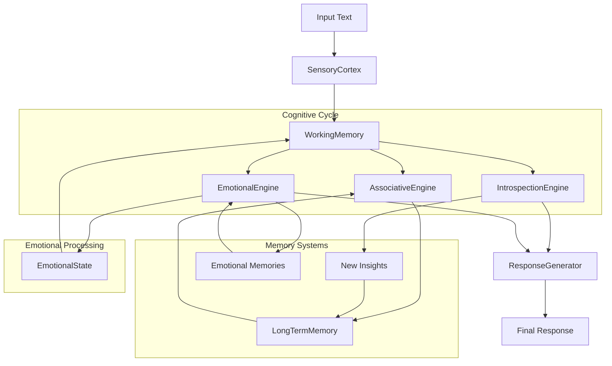

# Metacognitive Engine: AI Consciousness Simulation

[](https://www.python.org/downloads/)
[](https://pytest.org/)
[](https://github.com/psf/black)


> "The Dao that can be told is not the eternal Dao." - Laozi


A sophisticated artificial intelligence system implementing metacognitive architecture based on Global Workspace Theory. The system features persistent memory, self-reflection capabilities, **advanced emotional processing**, and real-time consciousness simulation through vector-based semantic search and LLM-powered introspection.

## 🧠 Architecture Overview



### Core Components

- **🧮 SensoryCortex**: AI-powered analysis of input intent, sentiment, and tone using Google Gemini
- **🧠 WorkingMemory**: Central coordination hub implementing Global Workspace Theory
- **🔗 AssociativeEngine**: Vector-based semantic search for relevant memory associations  
- **🤔 IntrospectionEngine**: LLM-powered insight generation and paradox detection
- **💖 EmotionalEngine**: Advanced emotional processing with PAD model and emotional memory
- **💭 ResponseGenerator**: Emotionally-aware response synthesis using context and memories
- **💾 LongTermMemory**: Persistent vector database using ChromaDB with sentence transformers

## 🚀 Features

- **Persistent Memory**: Vector-based storage with semantic similarity search
- **Real-time Consciousness**: Multi-cycle cognitive processing with stabilization
- **AI-Powered Analysis**: Google Gemini integration for natural language understanding
- **🆕 Emotional Intelligence**: PAD emotional model with AI-powered emotion analysis
- **🆕 Emotional Memory**: Persistent emotional memories with decay and relevance scoring
- **🆕 Emotionally-Aware Responses**: Context-sensitive emotional response generation
- **MCP Integration**: Works directly with Cursor IDE as a tool
- **Multilingual Support**: English and Russian language processing
- **Self-Reflection**: Generates insights, questions, and identifies paradoxes
- **Production Ready**: Comprehensive testing, error handling, and logging

## 📦 Installation

### Prerequisites

- Python 3.9 or higher
- Google Gemini API key (for AI analysis)

### Quick Start

1. **Clone the repository**
   ```bash
   git clone https://github.com/netsky-devel/Metacognitive-Engine-AI-Consciousness-Simulation.git
   cd Metacognitive-Engine-AI-Consciousness-Simulation
   ```

2. **Install dependencies**
   ```bash
   pip install -r requirements.txt
   ```

3. **Download spaCy model**
   ```bash
   python -m spacy download en_core_web_sm
   ```

4. **Set up environment**
   ```bash
   cp .env.example .env
   # Edit .env and add your GEMINI_API_KEY
   ```

5. **Initialize the system**
   ```bash
   python test_system.py
   ```

### Environment Variables

Create a `.env` file in the project root:

```env
GEMINI_API_KEY=your_gemini_api_key_here
```

## 🔧 Usage

### As MCP Tool in Cursor

The system can be used directly in Cursor IDE as an MCP tool:

1. Start the MCP server:
   ```bash
   python src/mcp_server.py
   ```

2. Configure Cursor to use the MCP tool

3. Use the tool functions:
   - `add_memory`: Add new memories
   - `query_memories`: Search for relevant memories
   - `reflect_on_thought`: Generate insights from thoughts
   - `process_thought`: Advanced multi-cycle processing

### Python API

```python
from src.engine.engine import MetacognitiveEngine
from src.engine.models.entry import Entry, EntryType
from src.engine.models.emotional_state import EmotionalState, EmotionType

# Initialize the engine with emotional processing
engine = MetacognitiveEngine(enable_emotions=True)

# Add memories
entry = Entry(
    content="Consciousness is the subjective experience of awareness",
    entry_type=EntryType.INSIGHT
)
engine.add_memory(entry)

# Process thoughts with full cognitive cycles (includes emotional processing)
response = engine.process_thought("I'm excited about AI consciousness research!")
print(response)

# Access emotional state (if emotions enabled)
if engine.emotional_engine:
    emotional_summary = engine.emotional_engine.get_emotional_state_summary()
    print(f"Current emotional state: {emotional_summary['current_state']}")

# Legacy reflection mode
insights = engine.analyze_new_thought("How does AI relate to consciousness?")
for insight in insights:
    print(f"{insight.entry_type.name}: {insight.content}")
```

### Emotional Processing API

```python
from src.engine.models.emotional_state import EmotionalState, EmotionType

# Create emotional states
emotional_state = EmotionalState(
    valence=0.8,    # Positive emotion
    arousal=0.9,    # High energy
    dominance=0.7   # Feeling in control
)

# Add specific emotions
emotional_state.add_emotion(EmotionType.JOY, 0.9)
emotional_state.add_emotion(EmotionType.EXCITEMENT, 0.8)

# Get emotional insights
print(f"Dominant emotion: {emotional_state.get_dominant_emotion().value}")
print(f"Emotional quadrant: {emotional_state.get_emotional_quadrant()}")
print(f"Summary: {emotional_state.to_summary_string()}")

# Blend emotional states
other_state = EmotionalState(valence=-0.3, arousal=0.6)
other_state.add_emotion(EmotionType.WORRY, 0.7)

blended = emotional_state.blend_with(other_state, weight=0.3)
print(f"Blended state: {blended.to_summary_string()}")
```

### REST API

Start the FastAPI server:
```bash
uvicorn src.mcp_server:app --reload
```

#### Endpoints

- **POST** `/add` - Add new memory
- **POST** `/query` - Search memories  
- **POST** `/reflect` - Reflect on thought (legacy)
- **POST** `/process` - Advanced cognitive processing
- **GET** `/list` - List all memories
- **POST** `/clear` - Clear all memories

#### Example Usage

```bash
# Add a memory
curl -X POST "http://localhost:8000/add" \
     -H "Content-Type: application/json" \
     -d '{"content": "AI systems require consciousness for true understanding", "entry_type": "insight"}'

# Process a thought
curl -X POST "http://localhost:8000/process" \
     -H "Content-Type: application/json" \
     -d '{"content": "How does consciousness emerge from neural networks?"}'

# Query memories
curl -X POST "http://localhost:8000/query" \
     -H "Content-Type: application/json" \
     -d '{"content": "consciousness emergence", "n_results": 3}'
```

## 🎭 Emotional System Demo

Experience the new emotional processing capabilities:

```bash
# Run the interactive emotional system demo
python demo_emotional_system.py
```

The demo showcases:
- **Real-time Emotion Analysis**: AI-powered detection of emotions in text
- **Emotional State Transitions**: How emotions evolve during conversations  
- **Emotional Memory**: How past emotional experiences influence responses
- **Emotionally-Aware Responses**: Context-sensitive reply generation
- **PAD Model**: Pleasure-Arousal-Dominance emotional framework

### Emotional Processing Features

🎯 **18 Emotion Types**: Joy, sadness, anger, fear, surprise, curiosity, excitement, and more

🧠 **PAD Emotional Model**:
- **Valence**: Negative (-1.0) ↔ Positive (+1.0)  
- **Arousal**: Calm (0.0) ↔ Excited (1.0)
- **Dominance**: Submissive (0.0) ↔ Dominant (1.0)

🔄 **Emotional Quadrants**:
- **Excited**: High valence + High arousal
- **Content**: High valence + Low arousal  
- **Distressed**: Low valence + High arousal
- **Depressed**: Low valence + Low arousal

💾 **Emotional Memory**: Persistent memories with decay and relevance scoring

## 🧪 Testing

### Run All Tests

```bash
# Install test dependencies
pip install -r requirements.txt

# Run comprehensive test suite
pytest

# Run with coverage
pytest --cov=src --cov-report=html

# Run specific test categories
pytest -m unit          # Unit tests only
pytest -m integration   # Integration tests only
pytest -m "not slow"    # Exclude slow tests
```

### Test Categories

- **Unit Tests**: Individual component testing
- **Integration Tests**: Full system workflow testing  
- **API Tests**: FastAPI endpoint testing
- **Memory Tests**: Vector database and search testing

### Test Coverage

The test suite covers:
- ✅ All core components (Engine, Memory, Processors)
- ✅ **NEW**: Complete emotional system (25 tests)
- ✅ MCP server endpoints
- ✅ Error handling and edge cases
- ✅ Memory persistence and search
- ✅ Cognitive cycle processing
- ✅ AI integration (with mocking)
- ✅ **NEW**: Emotional state management and transitions
- ✅ **NEW**: Emotional memory with decay and relevance

## 📊 Performance & Configuration

### Memory Search Optimization

The system uses optimized distance thresholds for vector search:

- **Distance Threshold**: 8.0 (optimal balance of precision/recall)
- **Vector Model**: `paraphrase-multilingual-mpnet-base-v2`
- **Database**: ChromaDB with cosine similarity
- **Search Space**: HNSW indexing for fast retrieval

### Cognitive Processing

- **Max Cycles**: 3 (configurable)
- **Stabilization**: Automatic based on confidence scores
- **Memory Integration**: Real-time association retrieval
- **Response Generation**: Context-aware synthesis

## 🛠️ Development

### Project Structure

```
scientific_paper/
├── src/
│   ├── engine/
│   │   ├── memory/           # Memory systems
│   │   ├── processors/       # Cognitive processors  
│   │   ├── perception/       # Input analysis
│   │   ├── models/          # Data models
│   │   └── engine.py        # Main engine
│   └── mcp_server.py        # FastAPI/MCP server
├── tests/                   # Comprehensive test suite
├── data/                    # Persistent data storage
└── docs/                    # Additional documentation
```

### Key Design Patterns

- **Global Workspace Theory**: Central WorkingMemory coordination
- **Producer-Consumer**: Processor pipeline architecture  
- **Observer Pattern**: Event-driven insight generation
- **Strategy Pattern**: Configurable processing strategies
- **Repository Pattern**: Abstracted memory persistence

### Contributing

1. Fork the repository
2. Create a feature branch
3. Add comprehensive tests
4. Ensure all tests pass
5. Submit a pull request

### Code Quality

```bash
# Format code
black src/ tests/

# Type checking  
mypy src/

# Linting
flake8 src/ tests/

# Security scan
bandit -r src/
```

## 📈 System Metrics

### Performance Benchmarks

- **Memory Search**: < 100ms for 10K+ entries
- **Cognitive Cycle**: 2-5 seconds (with AI calls)
- **Vector Generation**: < 50ms per entry
- **Response Generation**: 1-3 seconds

### Memory Efficiency

- **Vector Dimensions**: 768 (sentence transformer)
- **Storage**: ~1KB per memory entry
- **Indexing**: HNSW with cosine similarity
- **Retrieval**: O(log n) average case

## 🔮 Roadmap

**Current Status: 9.6/10** - See detailed [ROADMAP.md](ROADMAP.md) for the path to 10/10

**Phase 1 (Next 1-2 weeks):** Foundation Strengthening
- [ ] **95%+ Test Coverage** (currently 75%)
- [ ] **Performance Monitoring** & observability
- [ ] **Production Readiness** enhancements

**Phase 2 (1-2 months):** Cognitive Enhancement  
- [ ] **Attention Mechanism**: Dynamic focus allocation
- [x] **Emotional Processing**: ✅ **COMPLETED** - PAD model with AI analysis
- [ ] **Memory Consolidation**: Sleep-like reorganization

**Phase 3 (2-3 months):** Advanced Cognition
- [ ] **Causal Reasoning**: Cause-effect understanding
- [ ] **Multi-modal Input**: Image and audio processing
- [ ] **Meta-Cognitive Enhancement**: Self-monitoring

**Phase 4+ (3+ months):** Social Consciousness & Scientific Validation
- [ ] **Theory of Mind**: Understanding other agents
- [ ] **Scientific Validation**: Peer-reviewed research
- [ ] **Enterprise Scale**: Production deployment

See [ROADMAP.md](ROADMAP.md) for complete development plan.

## 📝 License

This project is licensed under the MIT License - see the [LICENSE](LICENSE) file for details.

## 🙏 Acknowledgments

- **Global Workspace Theory**: Bernard Baars
- **Sentence Transformers**: Hugging Face
- **Vector Database**: ChromaDB team
- **Language Models**: Google Gemini AI
- **MCP Protocol**: Anthropic

## 📞 Support

For questions, issues, or contributions:

- **GitHub Issues**: [Create an issue](https://github.com/netsky-devel/Metacognitive-Engine-AI-Consciousness-Simulation/issues)
- **Documentation**: See [ARCHITECTURE.md](ARCHITECTURE.md)
- **Email**: netsky_devel@proton.me

---
 